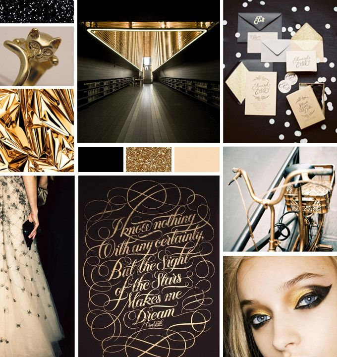

# Kit-cat-koh planning

## Vision/Goal

Our team's goal is to make tic-tac-toe with a twist - we're going to use 3d cats for the game board pieces

## Wireframes


## Mood board



## Sitemap

This is a one page site with no navigation so a sitemap isn't really relevant for planning.

## Character objects

```js
computer: {
    points: 0,
    turnsTaken: 1,
    isTurn: false,
}
player: {
    points: 0,
    turnsTaken: 1,
    isTurn: true,
}
```

## To-do list

[Link to to-do list on Trello](https://trello.com/b/6IThKJYC/kit-cat-koh-to-dos)
